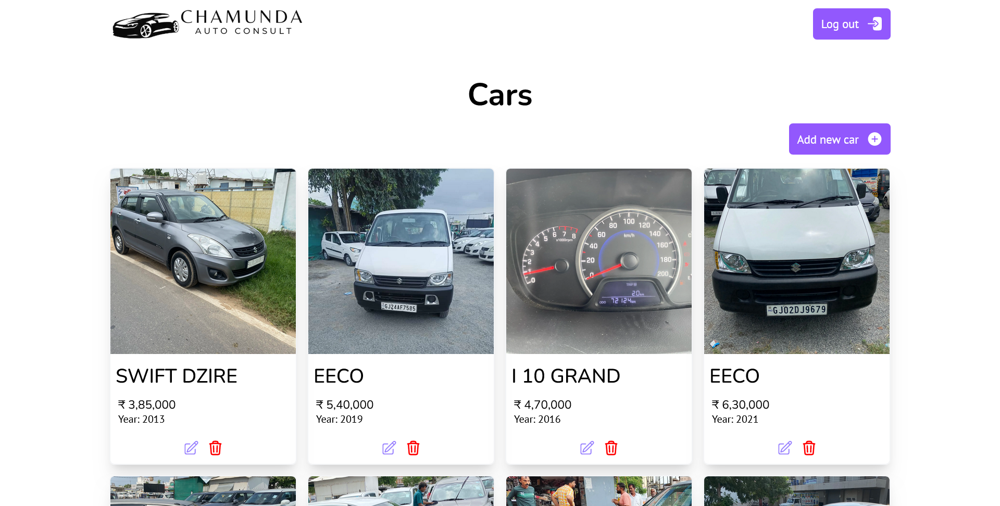
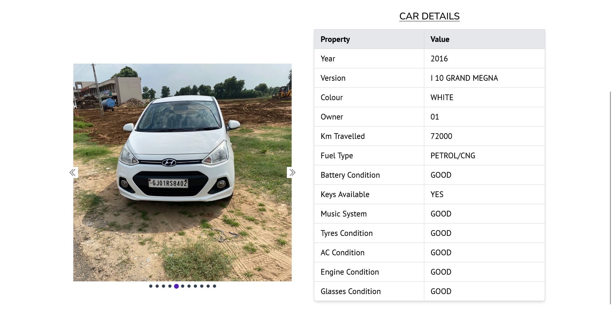
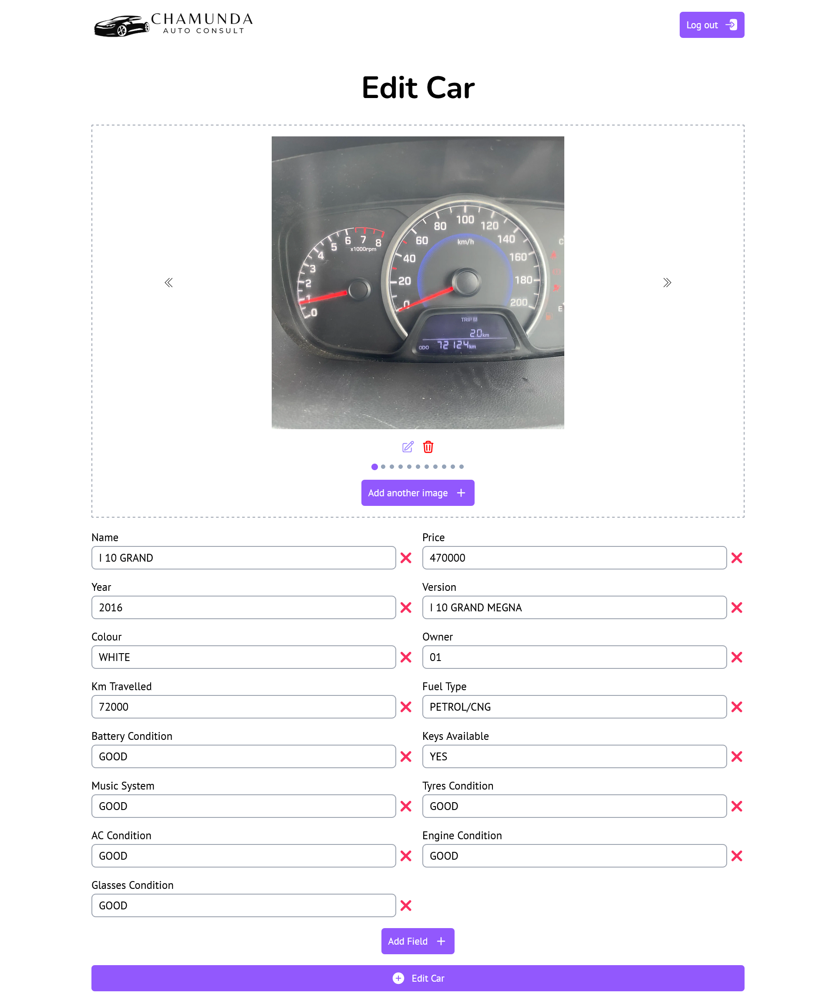

# Car Selling Website

This Website was created for a client to showcase the Cars that they sold. It has a customer facing Website where people can browse Cars and an admin dashboard through which the site owner can add, remove or edit Cars.

## Table of contents

- [Car Selling Website](#car-selling-website)
  - [Table of contents](#table-of-contents)
  - [Overview](#overview)
    - [The challenge](#the-challenge)
    - [Screenshots](#screenshots)
    - [Links](#links)
  - [My process](#my-process)
    - [Built with](#built-with)
    - [Challenges I faced](#challenges-i-faced)
    - [Useful resources](#useful-resources)
  - [Acknowledgements](#acknowledgements)
  - [Author](#author)
  - [Run Locally](#run-locally)

## Overview

### The challenge

Users should be able to:

- View all the Cars available for sale
- Browse the website from any device of any size

Admin should be able to:

- Add new Car for sale
- Update Car details and remove sold Cars


### Screenshots






### Links

- Solution URL: [Github](https://github.com/ChaudharyPradip/car-selling-website)
- Live Site URL: [Chamunda Auto Consultant](https://chamunda-auto-consult.vercel.app/)
## My process

### Built with

- [Next.js](https://nextjs.org/) - The React framework for the web
- [Cloudinary](https://cloudinary.com) - To store and serve images of Cars
- [MongoDB](https://www.mongodb.com/) - The Document database to store car details
- [MongoDB Atlas](https://www.mongodb.com/atlas) - The MongoDB database as a service on cloud
- [Tailwind](https://tailwindcss.com/) - CSS framework
- [React Toastify](https://fkhadra.github.io/react-toastify/introduction) - Toast Notifications library for react
- Mobile-first workflow
- Semantic HTML5 markup
- Flexbox
- Grid

### Challenges I faced

- Car Images upload kept failing because of large number of images as the Vercel server requests timed out\
  I stated uploading images directly to Cloudinary from client's device through pre-signed URLs.
- How do I create an Image Slider?\
  I ended up watching so many tutorials and brainstormed with Chat GPT as the tutorials did not exactly tackle my requirements.
- How do I efficiently show and allow the user to edit the images that they have loaded for upload?\
  I created an array of objects with each object having the unique ID for that image and a URL that stored dataURL until the image is uploaded and the Cloudinary Image URL afterwards.
- How to store Car details in a flexible way?\
  I ended up using MongoDB database without a Schema to store data in JSON like format.

### Useful resources

- [Next.js Docs](https://nextjs.org/docs) - These helped me in understanding some of the powerful features that Next.js offers like Image optimisation and many more.
- [Tailwind CSS Docs](https://tailwindcss.com/docs/) - It is very helpful to quickly find out tailwind equivalents of CSS properties.
- [Cloudinary Docs](https://cloudinary.com/documentation) - The Cloudinary docs helped me understand how to manage my Image files on their server and how to upload images to their servers directly from client's device using pre-signed URLs.
## Acknowledgements

- [Chat GPT](https://chat.openai.com/) - My developer buddy who helped me brainstorm various approaches to tackle my issues and gave solutions. (Though it frustrates sometimes when it doesn't have answer and keeps on giving same invaluable output, it was a good help overall)
## Author

- Frontend Mentor - [@ChaudharyPradip](https://www.frontendmentor.io/profile/ChaudharyPradip)
- Twitter - [@thePradiptalks](https://www.twitter.com/thePradiptalks)
## Run Locally

Clone the project

```bash
  git clone https://github.com/ChaudharyPradip/car-selling-website
```

Go to the project directory

```bash
  cd car-selling-website
```

Install dependencies

```bash
  pnpm install
```

Start the server

```bash
  pnpm run dev
```

